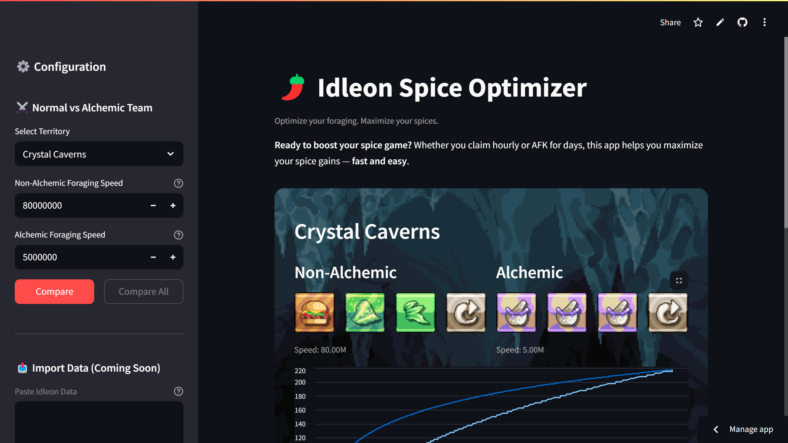

# 🌶️ Idleon Spice Optimizer

A lightweight and flexible **Streamlit** app focused on optimizing spice foraging efficiency in *Legends of Idleon*.

## 📸 Preview

## ☕ Support

If you find this project helpful, you can support its development here:

## 🛡️ License

This project is licensed under the [MIT License](LICENSE).
